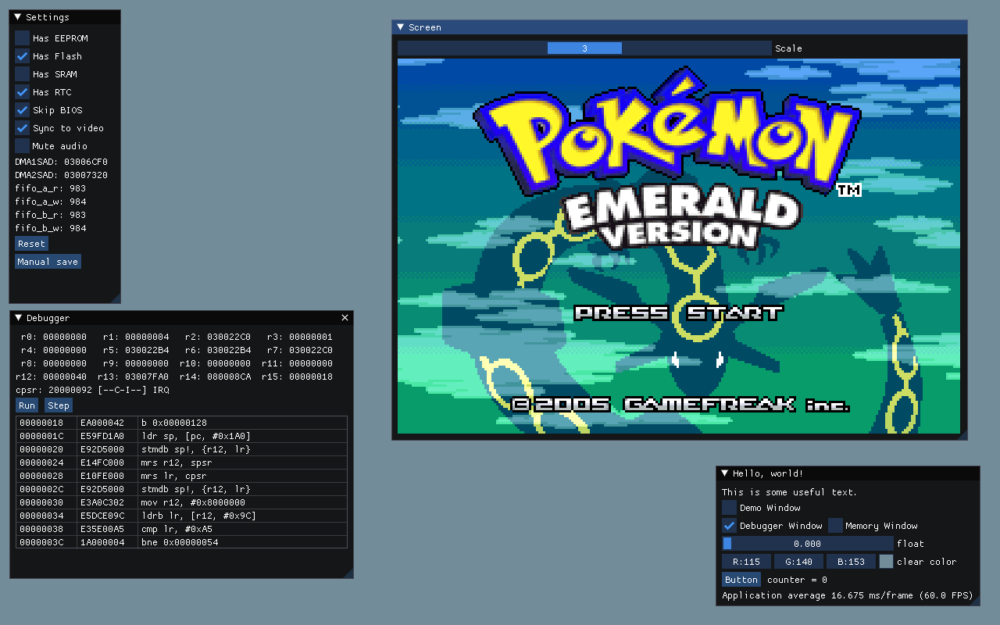

# ygba

Work-in-progress Game Boy Advance emulator

## Controls

| Button | Key                  |
|--------|----------------------|
| Up     | <kbd>&uarr;</kbd>    |
| Down   | <kbd>&darr;</kbd>    |
| Left   | <kbd>&larr;</kbd>    |
| Right  | <kbd>&rarr;</kbd>    |
| A      | <kbd>X</kbd>         |
| B      | <kbd>Z</kbd>         |
| L      | <kbd>A</kbd>         |
| R      | <kbd>S</kbd>         |
| Start  | <kbd>Enter</kbd>     |
| Select | <kbd>Backspace</kbd> |
